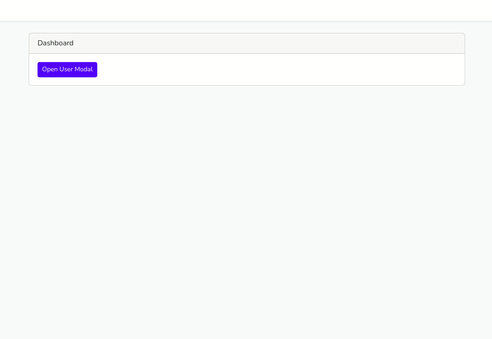

# Livewire Modal
## Screenshots



## Requirements
- [Laravel 8+](https://laravel.com/docs/10.x)
- [Livewire 2+](https://laravel-livewire.com/)
- [Bootstrap 5](https://getbootstrap.com/)
- [TomSelect](https://tom-select.js.org/) (if you want to use custom dropdown)

## Installation
```bash
  composer require markrefaat/livewire-modal
```
## Usage/Examples

```php
<?php

namespace App\Http\Livewire;

use Markrefaat\LivewireModal\LivewireModal;
use Markrefaat\LivewireModal\LivewireModalField;

class UserModal extends LivewireModal
{
    public $user;
    public $age;
    public $selectedUser;

    public function setUp()
    {
        $this->setModalId("userModal")
            ->setModalTitle("Create User")
            ->setOnOpenModalFunction("create")
            ->setModalType("formModal")
            ->setSubmitButtonText("Save")
            ->setSubmitButtonFunction("save");
    }

    public function getFieldsProperty()
    {
        return [
            LivewireModalField::type('dropdown')
                ->label('Users List')
                ->required(true)
                ->varName('selectedUser')
                ->options('users')
                ->optionValue('id')
                ->optionName('name'),
            LivewireModalField::type('text')
                ->label('Name')
                ->required(true)
                ->varName('user'),
            LivewireModalField::type('number')
                ->label('Age')
                ->varName('age'),
        ];
    }

    protected function rules()
    {
        return [
            'user' => ['required']
        ];
    }

    // Call on open modal
    public function create()
    {}

    // Call on submit form
    public function save()
    {}
}
```

```html
<livewire:user-modal />
```

```html
<a data-bs-toggle="modal" data-bs-target="#userModal" class="btn btn-primary" 
onclick="window.livewire.emit('userModal')">Open User Modal</a>
```

## Documentation

### 1. setUp Function

#### Example
```php
public function setUp()
    {
        $this->setModalId("tempModal")
            ->setModalTitle("Modal Title")
            ->setOnOpenModalFunction("create")
            ->setModalType("formModal")
            ->setSubmitButtonText("Save")
            ->setSubmitButtonFunction("save");
    }
```
setModalId( *Model Id to trigger open modal* )

setModalTitle( *"Modal displayed title"* )

setOnOpenModalFunction( *"On modal open function name"* )

setModalType( *(formModal, confirmationModal)* )

setShowCloseButton( *(true, false) "By default true".* ) __OPTIONAL__: *Show/Hide close button on the left of submit button*

setShowCloseIcon( *(true, false) "By default true".* )  __OPTIONAL__: *Show/Hide close icon on the right of the title*

#### If you choose "formModal" model type
setSubmitButtonText( *"Submit button displayed text"* )

setSubmitButtonFunction( *"Submit button function name"* )

#### If you choose "confirmationModal" model type
setConfirmButtonFunction( *"Confirm button function name"* )

setConfirmButtonText( *"Confirm button displayed text"* )

setConfirmMessage( *"Confirmation .essage"* )

### 2. getFieldsProperty Function (If you choose "formModal" model type)
return List of LivewireModalField.

### 3. getOptionsListProperty Function (If you choose "formModal" model type)
#### Example
```php
public function getOptionsListProperty()
    {
        return [
            'users' => User::get(),
        ];
    }
```

### 4. LivewireModalField (If you choose "formModal" model type)
type: *Input Types (checkbox, date, datetime-local, email, file, number, password,  text, textarea, __dropdown__).*

varName: *PHP variable linked to the input "wire:model".*

label __OPTIONAL__ : *Label above input.*

placeholder __OPTIONAL__: *Input placeholder*.

required __OPTIONAL__: *Show \* in label and placeholder (true, false) "By default false".*

disabled __OPTIONAL__: *(true, false) "By default false".*

class __OPTIONAL__: *Bootstrap classes for input "By default col-12".*

#### If you choose dropdown type:
options: The key from the list getOptionsListProperty().

optionName: The displayed value of the dropdown "ed. name".

optionValue: The actual value of the dropdown "ex. id".

optionMulti __OPTIONAL__: The max number of items the user can select.

defer __OPTIONAL__: *"wire:model.defer" (true, false) "By default true".*

### 5. Helper Functions
$this->closeModal();

$this->resetModal();

$this->resetModalExcept(['user', 'age']);
